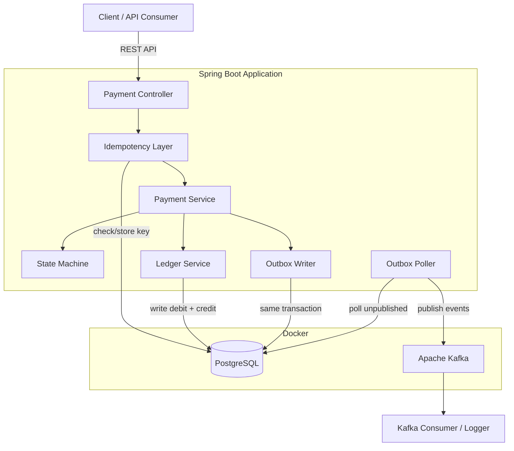
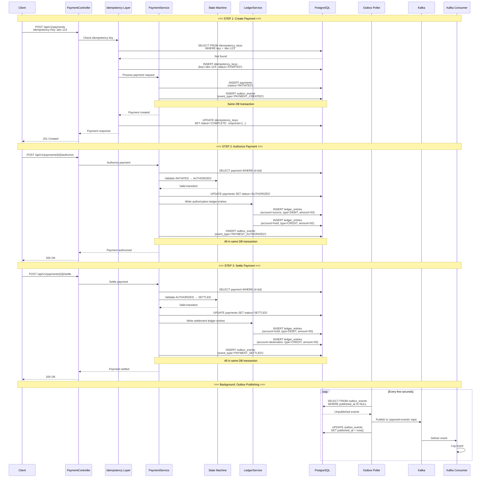
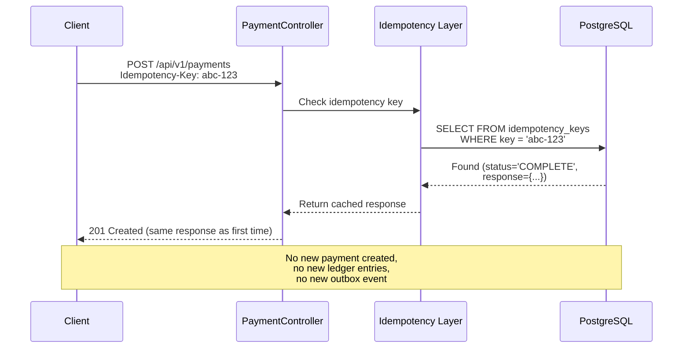
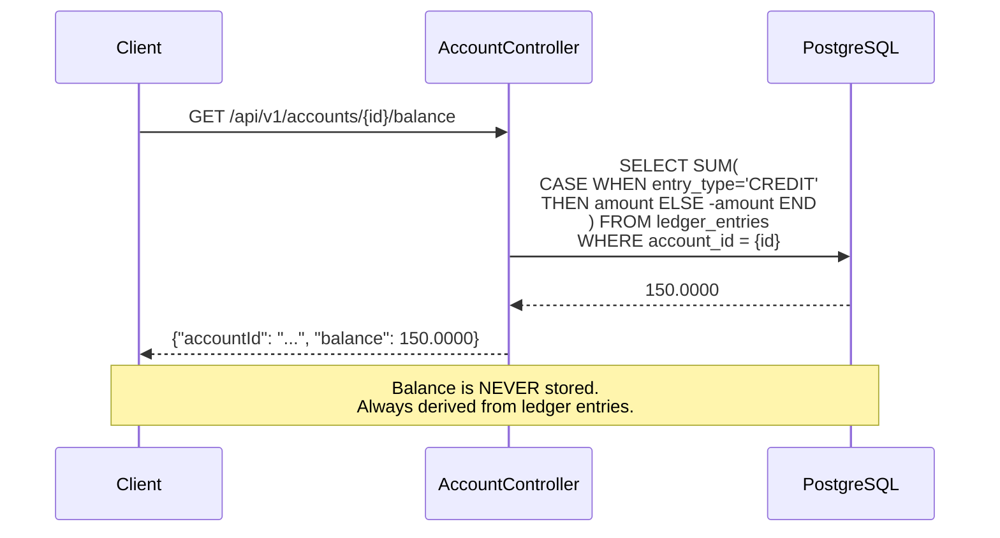
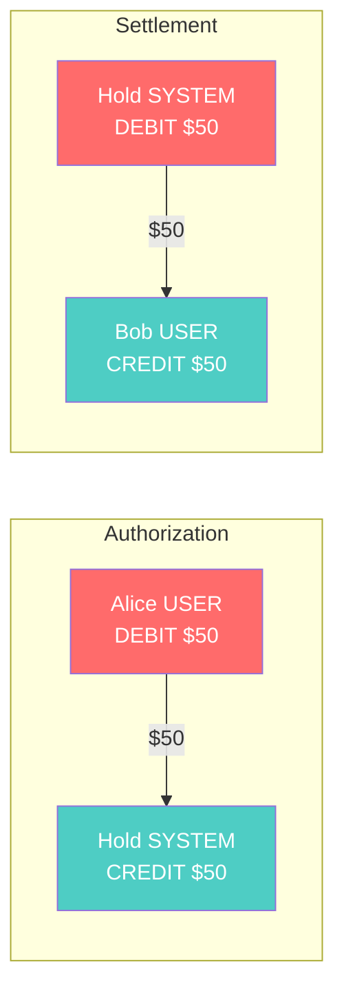
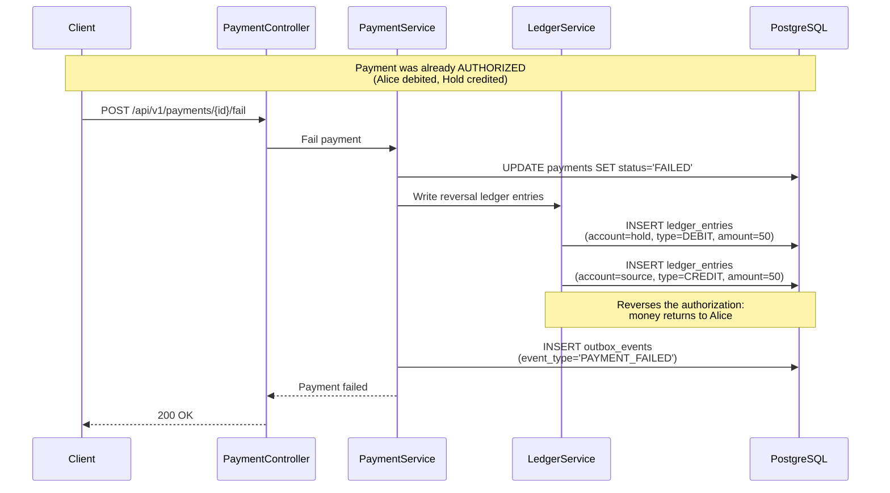

# Architecture Flow

## High-Level System Architecture

## Complete Payment Flow: Create → Authorize → Settle

## Idempotency Retry Flow

## Ledger Balance Derivation

## Money Flow Through Accounts

| Step | Debit (money leaves) | Credit (money enters) | Sum |
|------|---------------------|----------------------|-----|
| Authorize | Alice -$50 | Hold +$50 | $0 |
| Settle | Hold -$50 | Bob +$50 | $0 |
| **Net** | **Alice -$50** | **Bob +$50, Hold $0** | **$0** |

## Failed Payment Flow

