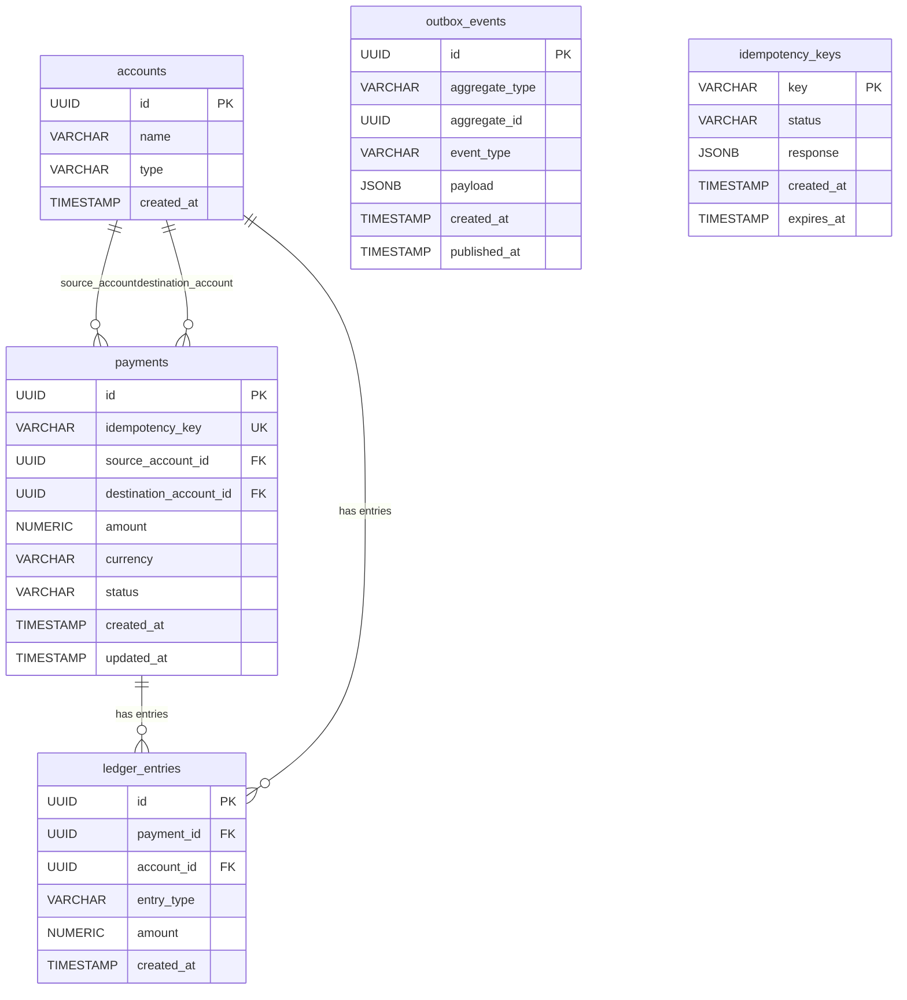
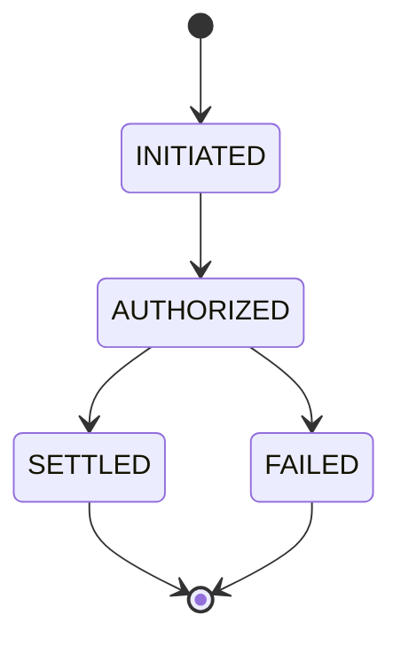

# Database Schema

## accounts

Represents both user-facing accounts (wallets) and internal system accounts (hold, fees). Every money movement in the ledger references an account on each side.

| Column | Type | Description |
|--------|------|-------------|
| `id` | UUID (PK) | Unique identifier, auto-generated |
| `name` | VARCHAR(255) | Human-readable account name (e.g., "Alice Wallet", "Hold Account") |
| `type` | VARCHAR(50) | `USER` for customer accounts, `SYSTEM` for internal accounts (hold, fees) |
| `created_at` | TIMESTAMP | When the account was created |

**Use cases:**
- Create a user wallet when a customer signs up
- Create system accounts (e.g., "Hold Account") on startup for authorization holds
- Look up an account to derive its balance from ledger entries

---

## payments

Tracks each payment through its lifecycle. A payment is the trigger for ledger entries — it represents intent to move money from one account to another.

| Column | Type | Description |
|--------|------|-------------|
| `id` | UUID (PK) | Unique identifier, auto-generated |
| `idempotency_key` | VARCHAR(255) | Client-provided key to prevent duplicate payments. Unique index ensures one payment per key |
| `source_account_id` | UUID (FK → accounts) | The account being debited (money leaves here) |
| `destination_account_id` | UUID (FK → accounts) | The account being credited (money arrives here) |
| `amount` | NUMERIC(19,4) | Payment amount. NUMERIC avoids floating-point precision errors with money |
| `currency` | VARCHAR(3) | ISO 4217 currency code, defaults to `USD` |
| `status` | VARCHAR(50) | Current state: `INITIATED`, `AUTHORIZED`, `SETTLED`, or `FAILED` |
| `created_at` | TIMESTAMP | When the payment was created |
| `updated_at` | TIMESTAMP | Last state transition timestamp |

**Use cases:**
- Customer initiates a $50 payment from their wallet to another user
- Payment processor authorizes the payment (funds held)
- Settlement job settles authorized payments (funds transferred)
- Retry with same idempotency key returns the original payment without re-processing

---

## ledger_entries

The immutable, append-only double-entry ledger. Every state transition that moves money writes exactly two entries (one debit, one credit) that sum to zero. Balances are never stored — they are derived by summing entries per account.

| Column | Type | Description |
|--------|------|-------------|
| `id` | UUID (PK) | Unique identifier, auto-generated |
| `payment_id` | UUID (FK → payments) | The payment that triggered this entry |
| `account_id` | UUID (FK → accounts) | The account this entry belongs to |
| `entry_type` | VARCHAR(10) | `DEBIT` (money leaves the account) or `CREDIT` (money enters the account) |
| `amount` | NUMERIC(19,4) | Always positive. The sign is determined by `entry_type` |
| `created_at` | TIMESTAMP | When the entry was written |

**Use cases:**
- Authorization: DEBIT source account $50, CREDIT hold account $50
- Settlement: DEBIT hold account $50, CREDIT destination account $50
- Balance query: `SUM(credits) - SUM(debits)` for an account
- Audit trail: list all ledger entries for a payment to see the full money flow

**Why immutable?** If you never update or delete ledger rows, you have a complete audit trail. Corrections are made by writing new compensating entries, not by editing old ones. This is how real accounting systems work.

---

## outbox_events

Implements the transactional outbox pattern. Instead of publishing to Kafka directly (which risks dual-write inconsistency), events are written to this table in the same database transaction as the ledger entry. A separate poller reads unpublished events and publishes them to Kafka.

| Column | Type | Description |
|--------|------|-------------|
| `id` | UUID (PK) | Unique identifier, auto-generated |
| `aggregate_type` | VARCHAR(100) | The type of entity this event is about (e.g., `Payment`) |
| `aggregate_id` | UUID | The ID of the entity (e.g., the payment ID) |
| `event_type` | VARCHAR(100) | What happened (e.g., `PAYMENT_AUTHORIZED`, `PAYMENT_SETTLED`) |
| `payload` | JSONB | Full event data serialized as JSON |
| `created_at` | TIMESTAMP | When the event was created |
| `published_at` | TIMESTAMP | When the event was published to Kafka. `NULL` means not yet published |

**Use cases:**
- Payment is authorized → outbox row written in the same transaction as ledger entries
- Poller picks up rows where `published_at IS NULL`, publishes to Kafka, marks them published
- If the poller crashes mid-publish, the row stays unpublished and gets retried (at-least-once delivery)

**Why not publish to Kafka directly?**
If you write to the DB and then publish to Kafka, and the app crashes between those two steps, you have a ledger entry with no event (or vice versa). The outbox guarantees: if the ledger entry exists, the event will eventually be published.

---

## idempotency_keys

Prevents duplicate processing of the same request. The client sends an `Idempotency-Key` header, and the server stores the key with its response. On retry with the same key, the cached response is returned without re-processing.

| Column | Type | Description |
|--------|------|-------------|
| `key` | VARCHAR(255) (PK) | The client-provided idempotency key (typically a UUID) |
| `status` | VARCHAR(20) | `STARTED` while processing, `COMPLETE` when done |
| `response` | JSONB | The cached response body, stored after successful processing |
| `created_at` | TIMESTAMP | When the key was first seen |
| `expires_at` | TIMESTAMP | When the key expires (24 hours after creation). Expired keys can be cleaned up |

**Use cases:**
- Client sends `POST /payments` with `Idempotency-Key: abc-123`
- Server creates an idempotency record with status `STARTED`, processes the payment, then updates to `COMPLETE` with the response
- Client retries with the same key → server finds the `COMPLETE` record and returns the cached response
- Cleanup job deletes expired keys older than 24 hours

---

## ER Diagram

> **Rendering the diagram:** Paste the Mermaid code block into [mermaid.live](https://mermaid.live) or view it directly on GitHub (GitHub renders Mermaid in markdown files).

### ER Diagram Legend

| Notation | Meaning |
|----------|---------|
| `PK` | Primary Key — uniquely identifies each row |
| `FK` | Foreign Key — references a row in another table |
| `UK` | Unique Key — enforces uniqueness (not a primary key) |
| `\|\|--o{` | One-to-many relationship. The `\|\|` side has exactly one, the `o{` side has zero or more |

**Relationship line symbols:**

| Symbol | Meaning |
|--------|---------|
| `\|\|` | Exactly one (mandatory) |
| `o\|` | Zero or one (optional) |
| `}o` | Zero or more (optional many) |
| `}\|` | One or more (mandatory many) |
| `o{` | Zero or more (many side of relationship) |

**Reading the relationships:**
- `accounts ||--o{ payments` → One account has zero or more payments (as source or destination)
- `payments ||--o{ ledger_entries` → One payment has zero or more ledger entries
- `accounts ||--o{ ledger_entries` → One account has zero or more ledger entries
- `outbox_events` and `idempotency_keys` are standalone — no foreign key relationships to other tables

## Payment State Machine

## Double-Entry Flow Example

A $50 payment from Alice to Bob:

**Step 1: Authorization**
| Entry | Account | Type | Amount |
|-------|---------|------|--------|
| 1 | Alice (USER) | DEBIT | $50.00 |
| 2 | Hold (SYSTEM) | CREDIT | $50.00 |

*Sum = 0. Alice's available balance decreases, funds are held.*

**Step 2: Settlement**
| Entry | Account | Type | Amount |
|-------|---------|------|--------|
| 3 | Hold (SYSTEM) | DEBIT | $50.00 |
| 4 | Bob (USER) | CREDIT | $50.00 |

*Sum = 0. Hold is released, Bob receives the funds.*

**Final balances (derived from ledger):**
- Alice: -$50 (one debit)
- Bob: +$50 (one credit)
- Hold: $0 (one credit + one debit cancel out)